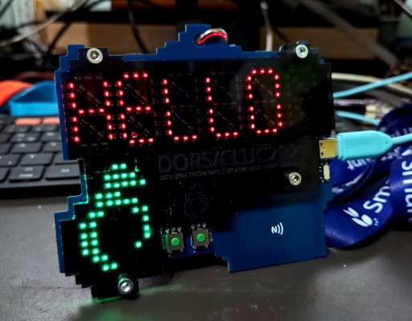
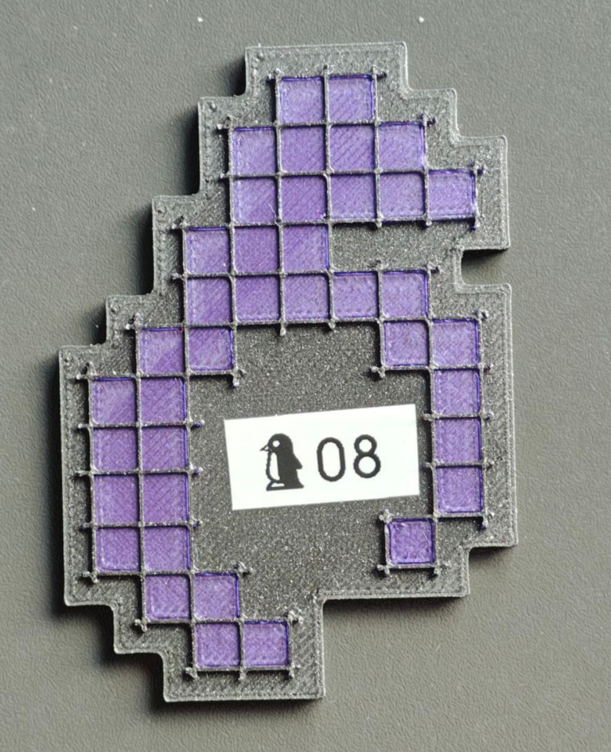

# DORS/CLUC Conference badge 2025

More info at: [https://www.dorscluc.org/badge](https://www.dorscluc.org/badge/)

----------------------------------------

This year’s badge has a number of functionalities, to be used both during and after the conference. During the conference the display can show your name (or any other text) and you also use it for quests. After the conference it can be used as a handy desktop notifier or a clock. And, of course, there’s a game available on it (not really Doom but it’s fast paced and action packed).

The badge contains a six character 9-segment display, logo shaped LED matrix, a NFC reader/writer, two buttons and a USB connection.

## How to set my own text?

The badge has six character alphanumeric display. It can show messages of up to 30 characters.

To set your custom text, hold the BTN1 for about three to five seconds until the badge switches to configuration mode. In that mode the BTN1 will move the cursor position while BTN2 will change the character under the cursor (hold it for fast character listing). To delete a character, select a space symbol (after number 9). To save the text hold the BTN1 again for three to five seconds until OK appears on screen.

## Quests? You said quests?

Yes! One is treasure hunt and another is badge hunt.

On the conference site there are nine hidden tags and your quest is to “collect” them all (tap them with your badge, please don’t physically take them). Each hidden tag will light up part of the logo on the badge. The first person who gets all of them will get a small reward.

Just like the last year’s badge which motivated attendants to interact with each other, this year’s badge also has an “interaction counter”. Put the antennas on two badges next to each other for a couple of seconds (it’s best to hold them both upwards and put antennas one over another so both screens could be seen) until both of them show the “NEW BADGE FOUND” text and they will exchange their details, incrementing the badge counter. NOTE: due to the power saving feature this might need to be repeated multiple times.

To check the current status of both quests press the BTN2 once or twice.

Note: in order to preserve the battery life, the NFC reader is in power save mode and it will activate when it detects a moving metal object nearby. Because of that sometimes it will be necessary to try the action (tapping the hidden tag or another badge) a couple of times.

## There are other modes?

I’m glad you asked. Yes, there are other modes on the badge:

    Conference mode scrolling text with quests)
    Clock (not really precise, needs configuration)
    Notifier (“passthrough” mode allowing you to set the screen over USB so it can be used as a desktop notifier)
    Game (a game!)
    Test (hardware test used during production)

To change the mode press and hold both buttons while powering on the badge. After a couple of seconds MODE will appear on screen. Use buttons to select the mode you like to try and press and hold both buttons for three to five seconds to confirm the selection.

## Configuration

When the badge is not in the notifier mode, some settings can be configured using the configuration menu available over USB connection. Connect the badge to computer (it probably won’t work on smartphone) and a new serial port will appear (/dev/ttyACM* on Linux, COM* on Windows). Connect to it either using some terminal program (miniterm, putty, screen, …) or even a web client such as the one available at https://www.anticyclone-systems.co.uk/aslwebterm.php (a Chromium based browser needs to be used as Firefox doesn’t support WebSerial). Make sure that Enter is set as CR+LF, click Connect and select your badge. Press Enter to redraw the menu. In case the Enter doesn’t work, try Ctrl+J.

## Notifier mode

When in notifier mode the serial terminal isn’t used for configuration but for the control. Each command must end ith a newline. Here are the commands:

- `S<some text>` will display that text on screen (for example “`Sshow this`”)
- `G<char_idx><segment_idx><1|0>` will control a specified character segment. `<char_idx>` is character index (0-5), `<segment_idx>` is the index of the segment (0-8) and `1|0` controls whether to turn the segment on or off. For example “`G161`” will turn on the middle horizontal segment on second character.
- `L<led_idx><1|0>` will turn the specified LED in the logo on or off. `<led_idx>` is in the range 00-39 (with leading zero). For example “`L021`” will turn on the led with index 2.
- `C` will clear the screen and LED matrix.

## License

ST middlewares and libraries are licensed under ST SLA0044 license. Shell menu is licensed under GPLv3. The rest of the code is licensed under MIT license.

The badge is designed by Igor Brkić from [https://hyperglitch.com](https://hyperglitch.com).

